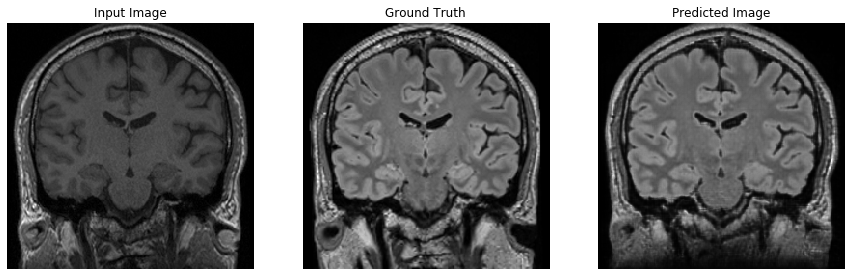
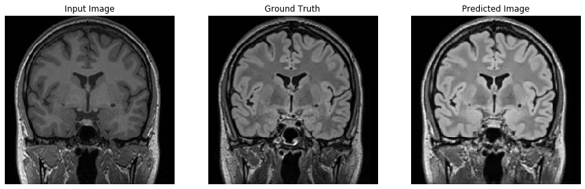
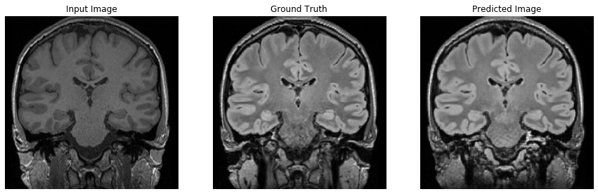
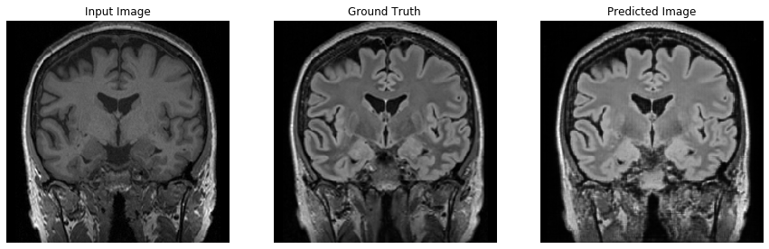

# DeepFCD
Detect focal cortical dysplasias using a generative modelling approach as presented on OHBM 2019 in Rome (see our homepage for e-Poster, OHBM oral session and more information: https://www.translationalneuroimaging.de/ohbm-gan-talk )

Repository is WIP, nothing interesting to see here *yet*.

## Software used
Python 3.7.4  
Tensorflow 2.0.0  
Nibabel 2.5.1  
Numpy 1.17.2  
PIL 6.2.0  

### For 3D-GAN and 3D-CNN training:
CUDA release 10.2

GAN inspired by pix2pix (Isola, Zhu et al., 2016)  
(github repo: https://github.com/phillipi/pix2pix)  

## GAN example output

